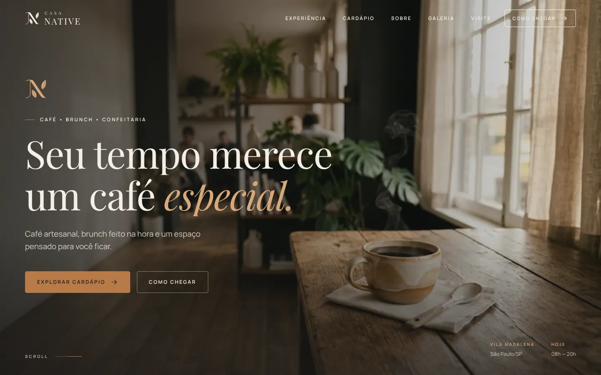
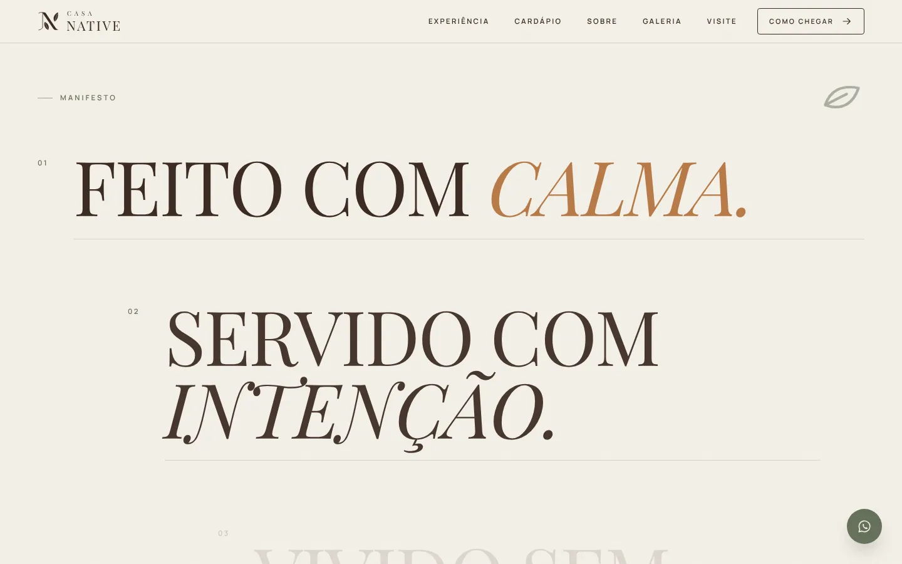
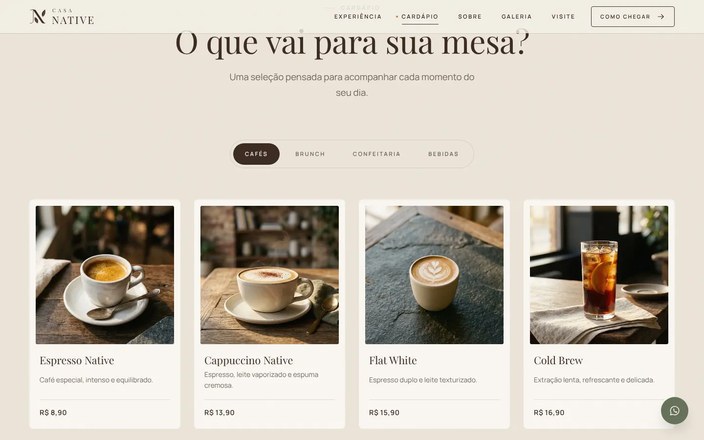
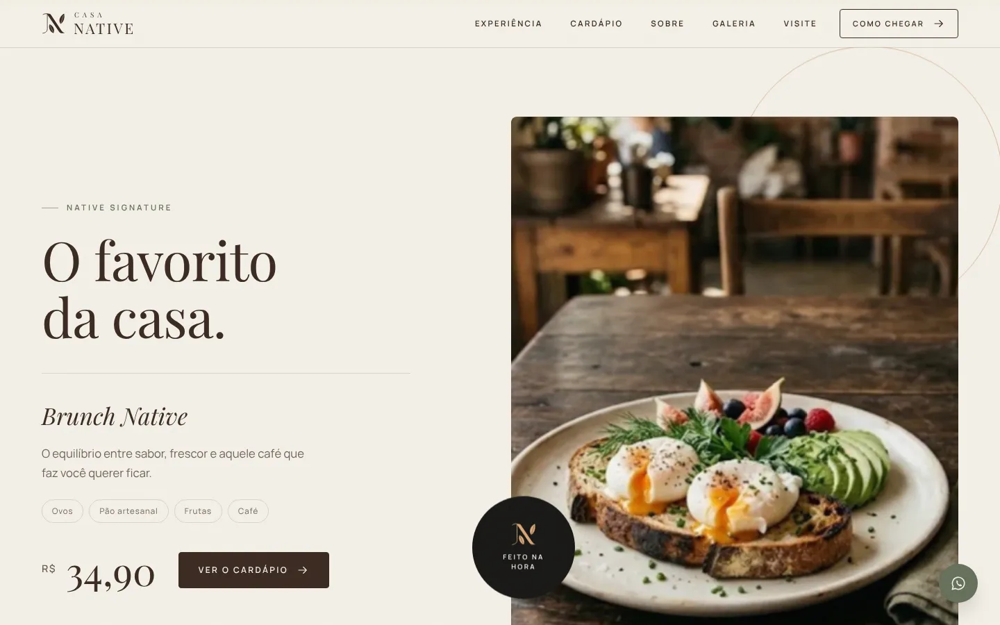
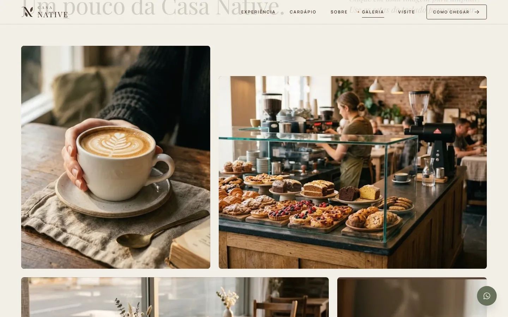
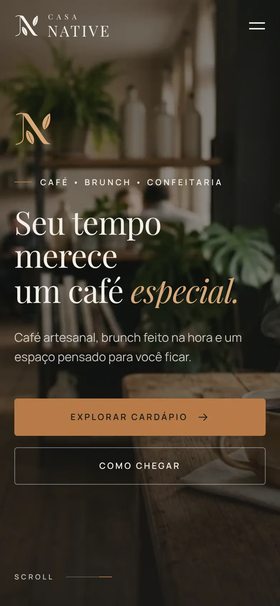
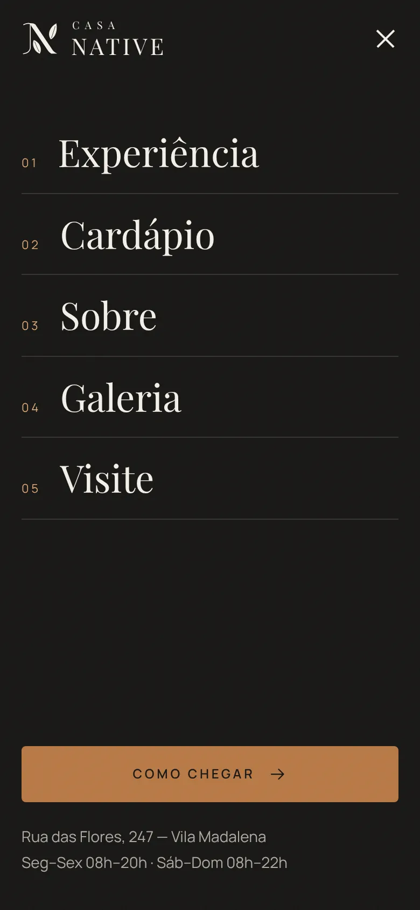
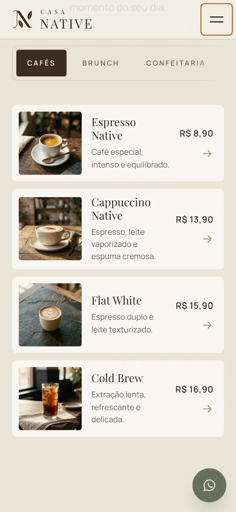

# CASA NATIVE

**Café • Brunch • Confeitaria**

Projeto conceitual fictício desenvolvido para demonstração de habilidades em desenvolvimento web, UI/UX e interação.



> **Projeto conceitual fictício desenvolvido para demonstração de portfólio.**
> A Casa Native não é uma empresa real. Endereço, história, preços, depoimentos, produtos, horários, Instagram e localização fazem parte do universo conceitual do projeto.

---

## Sobre

A Casa Native é uma cafeteria conceitual criada para explorar uma experiência digital premium. O conceito central da marca — **"um lugar para desacelerar"** — guia todas as decisões do site: tipografia editorial, muito espaço em branco, paleta quente e um sistema de movimento calmo, em que cada animação tem um propósito.

A página é uma **narrativa editorial longa**, não uma landing page de seções empilhadas. O ritmo de rolagem alterna impacto, respiro, história, movimento, informação, interação e conversão.

## Por que este projeto?

Este projeto foi desenvolvido para demonstrar a criação de uma experiência digital completa, desde a identidade visual até a implementação de interações, responsividade e experiência do usuário.

## Tecnologias

- HTML5 semântico
- CSS3 (custom properties, Grid, Flexbox, `clamp()`, `prefers-reduced-motion`)
- JavaScript puro (sem frameworks e sem dependências)
- Web APIs: `IntersectionObserver`, `<dialog>`, `requestAnimationFrame`, `Intl.DateTimeFormat`

Nenhuma biblioteca externa foi necessária: todas as interações foram construídas com recursos nativos do navegador, o que mantém o projeto leve e simples de executar.

## Recursos

- Design responsivo (celulares pequenos até monitores grandes)
- Loading com o símbolo desenhado progressivamente
- Navbar dinâmica (transparente no hero, fundo com blur após o scroll, tema claro/escuro conforme a seção, link ativo)
- Menu mobile em tela cheia, acessível
- Hero com entrada orquestrada, text reveal e zoom/parallax no scroll
- Manifesto com frases que "acendem" conforme a rolagem
- Scroll animations (reveal por opacidade, deslocamento e máscara)
- Parallax sutil (desligado no mobile e com reduced motion)
- Horizontal scroll vinculado ao scroll vertical (desktop) e carrossel com swipe (mobile)
- Cardápio com abas animadas e navegação por teclado
- Modal de produto com detalhes do item (vira *bottom sheet* no mobile)
- Galeria editorial assimétrica com lightbox (teclado, swipe, contador)
- Ambiente com troca de imagem por hover/foco (storytelling)
- Carrossel de depoimentos com swipe, setas, indicadores e avanço automático pausável
- FAQ em accordion animado
- Status "aberto agora" calculado no fuso de São Paulo
- Cursor personalizado e botões magnéticos (somente desktop)
- Microinterações em botões, links, cards, abas, formulário e menu
- Textura *grain* sutil
- SEO (title, description, Open Graph, favicon, dados estruturados, um único H1)
- Acessibilidade (HTML semântico, foco visível, ARIA, ESC em modais e menu, foco preso e devolvido, `prefers-reduced-motion`)

## Screenshots

| Desktop | |
|---|---|
|  |  |
|  |  |

| Mobile | | |
|---|---|---|
|  |  |  |

> As fotografias deste projeto conceitual foram geradas por IA, apenas para demonstração.

## Estrutura

```text
casa-native/
├── index.html
├── css/
│   ├── style.css          # tokens, base, componentes e seções
│   ├── animations.css     # estados de entrada, keyframes, reduced motion
│   └── responsive.css     # breakpoints (1200 · 1024 · 900 · 720 · 560 · 380)
├── js/
│   ├── main.js            # configuração, utilitários e inicialização
│   ├── animations.js      # loader, reveal, text reveal, hero, parallax, scroll horizontal
│   ├── menu.js            # navbar dinâmica e menu mobile
│   ├── modal.js           # controlador de <dialog> e modal de produto
│   ├── gallery.js         # lightbox e carrossel de depoimentos
│   └── interactions.js    # abas, FAQ, ambiente, cursor, magnético, status
├── assets/
│   ├── images/            # fotografias 
│   ├── icons/
│   └── logo/              # logo, símbolo, versões clara/escura, favicons
├── docs/screenshots/
├── README.md
└── LICENSE
```

Os ícones de interface ficam em um *sprite* SVG embutido no `index.html` (um único download, herdam a cor do texto).

## Como executar

Não há build nem dependências.

1. Clone o repositório:
   ```bash
   git clone https://github.com/SEU-USUARIO/casa-native.git
   ```
2. Abra o `index.html` no navegador **ou** use um servidor local (recomendado), por exemplo a extensão *Live Server* do VS Code, ou:
   ```bash
   npx serve .
   ```

Para publicar no **GitHub Pages**: *Settings → Pages → Deploy from a branch → main / root*.

## Imagens

As fotografias ficam em `assets/images/` em `.webp`, com o nome e a proporção definidos pelo layout. Para trocar qualquer foto, basta **substituir o arquivo mantendo o mesmo nome** e a mesma proporção — o layout não muda. Se alguma imagem faltar, o bloco exibe um fundo com as cores e o símbolo da marca, sem quebrar a página.

| Arquivo | Proporção | Tamanho sugerido | Onde aparece |
|---|---|---|---|
| `hero.webp` | 16:10 | 2400 × 1500 | Hero |
| `story.webp` | 4:5 | 1200 × 1500 | Nossa história |
| `coffee.webp`, `brunch.webp`, `conversation.webp`, `moment.webp` | 4:5 | 1200 × 1500 | A experiência Native |
| `menu-*.webp` (13 arquivos) | 1:1 | 900 × 900 | Cardápio e modal |
| `signature.webp` | 4:5 | 1600 × 2000 | Produto destaque |
| `stay.webp` | 16:9 | 2400 × 1350 | Fique mais um pouco |
| `gallery-01.webp`, `gallery-04.webp` | 4:5 | 1200 × 1500 | Galeria |
| `gallery-02.webp`, `gallery-03.webp` | 3:2 | 1800 × 1200 | Galeria |
| `gallery-05.webp` | 1:1 | 1200 × 1200 | Galeria |
| `gallery-06.webp` | 9:5 | 1800 × 1000 | Galeria |
| `ambiance-work.webp`, `ambiance-meet.webp`, `ambiance-slow.webp`, `ambiance-celebrate.webp` | 4:5 | 1200 × 1500 | Ambiente |
| `instagram-01.webp` … `instagram-06.webp` | 1:1 | 1080 × 1080 | Instagram |
| `og-cover.jpg` | 1.91:1 | 1200 × 630 | Compartilhamento (Open Graph) |

Direção fotográfica: luz natural, tons quentes, sombras suaves, profundidade de campo, close-ups e texturas. Use `object-position` no CSS caso algum enquadramento precise de ajuste. Ao trocar as fotos, revise também os textos `alt` no `index.html`.

## Configuração

Os dados de contato ficam em `js/main.js`, no objeto `CN.config`:

```js
instagramUrl: '',     // URL do perfil, quando existir
whatsappNumber: '',   // somente dígitos, ex.: 5511999999999
mapUrl: '...',        // link do botão "Abrir no mapa"
hours: { ... }        // funcionamento (status "aberto agora")
```

Enquanto `instagramUrl` e `whatsappNumber` estiverem vazios, os botões exibem um aviso discreto em vez de levar a um perfil ou número inexistente. O mapa é ilustrativo e o botão abre a região da Vila Madalena, já que o endereço é conceitual.

## Acessibilidade e movimento

- Com `prefers-reduced-motion: reduce`, o site remove loading, parallax, scroll horizontal vinculado, cursor personalizado, botões magnéticos e transições não essenciais — todo o conteúdo continua disponível.
- Sem JavaScript, o conteúdo é exibido normalmente (o FAQ fica aberto e a experiência vira um carrossel com rolagem nativa).

## Status

Projeto conceitual.

## Observação

A Casa Native é uma empresa fictícia criada exclusivamente para demonstração de portfólio.

## Licença

Código sob licença [MIT](LICENSE). A marca Casa Native e seu conteúdo são fictícios e fazem parte do projeto conceitual.
